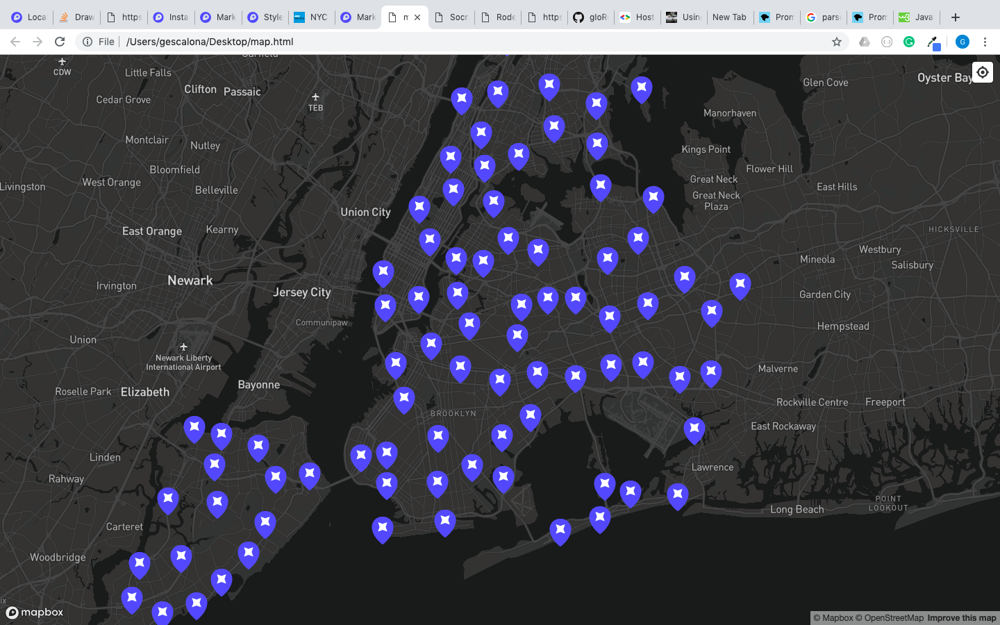

# Directions for the last homework:
1. Finish the classwork. This included:
    -  Render a map
    -  In dark theme.
    -  With tools (zoom in, current location).
    -  Using [this data](https://data.cityofnewyork.us/Health/Rodent-Inspection/p937-wjvj), put the points onto the map
2. With the map, now provide pop-ups that show the severity of the inspection in each coordinate.
    - **Bonus**: Use icons and depending on the severity of the insepection, change its color (for example: green means safe and red means dangerous)
3. Finish the other homework, and mention us on github.
# Sample:

Cheers!
